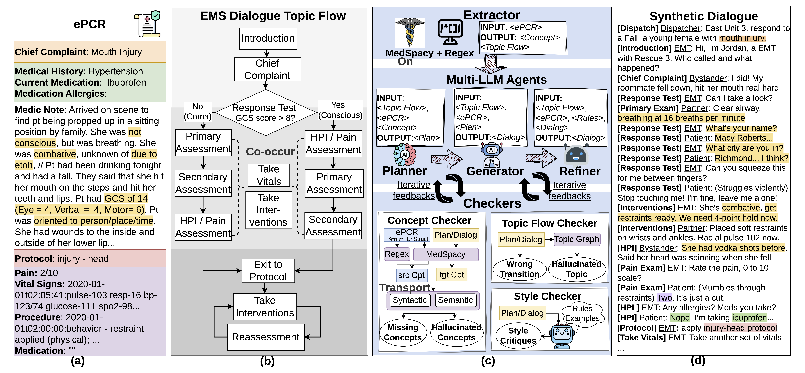

<div align="center">

# EMSDialog: Synthetic Multi-person Emergency Medical Service Dialogue Generation from Electronic Patient Care Reports via Multi-LLM Agents

### 🏛️ Findings of ACL 2026

[🌐 Project](https://uva-dsa.github.io/EMSDialog/) · [📄 Paper](https://arxiv.org/pdf/2604.07549) · [🤗 Dataset](https://huggingface.co/datasets/Xueren/EMSDialogue-Datasets)

</div>

---

<p align="center">
  
</p>

## Contributions

1. We propose a *scalable, EHR-grounded, multi agent pipeline for synthetic multi-party dialogue generation*, ensuring realism and factuality via independent **rule-based** concept and topic-flow checkers and an **iterative critique-and-refine loop**.

2. We introduce **EMSDialog**, an EMS-specific synthetic dataset of 4,414 realistic multi-party conversations, generated based on a real-world ePCR dataset and annotated with 43 diagnoses, turn level speaker roles and topics. Human expert and LLM-based evaluations show strong quality at both utterance level (realism, safety, role accuracy, groundedness) and conversation level (logical flow, factuality, diversity). 

3. We demonstrate the downstream utility of EMSDialog by training models of different sizes for **conversational diagnosis prediction** and evaluating them on real-world EMS conversations. Experiments show that EMSDialog-augmented training improves prediction accuracy, timeliness, and stability, and combining synthetic with real data yields the strongest overall performance. 

---

## Dataset

- 🤗 **Synthetic EMSDialog Dataset:** [Link](https://huggingface.co/datasets/Xueren/EMSDialogue-Datasets)
- 🩺 **Our dataset is also available at** [github repo data](https://github.com/UVA-DSA/EMSDialog/tree/main/data)
<!-- - 🤗 **Synthetic EMSDialog Dataset:** [Link](https://github.com/UVA-DSA/EMSDialog/tree/main/data/ours_clean) -->
<!-- - 🩺 **Real-world EMS Dialogue Dataset:** [Link](https://github.com/UVA-DSA/EMSDialog/tree/main/data/realworld_ems) -->
---

## How to Run the Code

### Synthetic Data Generation

```bash
python generate.py --model_name_or_path=Qwen/Qwen3-32B --enable_concept_check --enable_topicflow_check --enable_style_check
````

### Conversational Diagnosis Prediction

#### Static Training

```bash
cd ./code/bash
./static_train_4b_ours.sh
```

#### Dynamic Training

```bash
cd ./code/bash
./dynamic_train_4b_ours.sh
```

---

## Citation

If you find this work useful, please consider citing our paper.
```bibtex
@misc{ge2026emsdialogsyntheticmultipersonemergency,
      title={EMSDialog: Synthetic Multi-person Emergency Medical Service Dialogue Generation from Electronic Patient Care Reports via Multi-LLM Agents}, 
      author={Xueren Ge and Sahil Murtaza and Anthony Cortez and Homa Alemzadeh},
      year={2026},
      eprint={2604.07549},
      archivePrefix={arXiv},
      primaryClass={cs.CL},
      url={https://arxiv.org/abs/2604.07549}, 
}
```